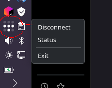

ScalyTail
---

A pyqt6 systray client for Tailscale

Usage
---
All interactions are from the tray:
Right-click for:
- Connect / Disconnect
- Status
- Exit

Click the tray icon to show the tailscale web status page (same as right-click -> status)



Pre-requisites
---
You must have tailscaled already installed and running. I highly suggest
running from within a console the first time to check for any errors. This
app requires that tailscale will accept `--operator={your user name}` on the
commandline, so at some point, you will need to issue the following command:
```
sudo tailscale set --operator={your user name}
```
eg: `sudo tailscale set --operator=billybob`

Installation
---
1. clone the repo somewhere
2. ensure you have either pyqt6 or pyqt6 installed (the app supports both)
    - on arch-based systems, `pacman -S python-pyqt6`
    - on deb-based systems, `apt install pyqt5-dev` or `apt install pyqt6-dev`
    - on gentoo systems, `emerge pyqt6`
3. you should be able to start with `./scalytail.py`
4. on linux machines, this should also attempt to install a .desktop file
   at ~/local/share/applications so you should be able to launch from your
   system menu, and notifications look good.